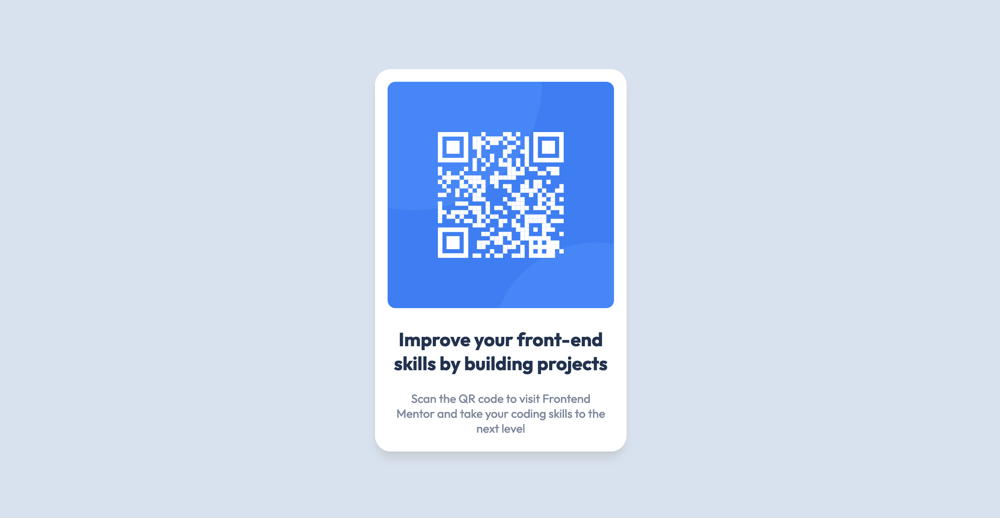

# Frontend Mentor - QR code component solution


## Welcome! 👋

## Table of contents

- [Frontend Mentor - QR code component solution](#frontend-mentor---qr-code-component-solution)
  - [Welcome! 👋](#welcome-)
  - [Table of contents](#table-of-contents)
  - [Overview](#overview)
    - [Screenshot :camera\_flash:](#screenshot-camera_flash)
    - [Links](#links)
  - [My process](#my-process)
    - [Built with :hammer:](#built-with-hammer)
    - [What I learned :brain:](#what-i-learned-brain)
    - [Continued development](#continued-development)
  - [Author](#author)

## Overview

### Screenshot :camera_flash:



### Links

- Solution URL: [Solution URL here](https:)
- Live Site URL: URL: [Solution URL here](https://github.com/LudivineV01/Qr-code-component)

## My process

### Built with :hammer:

- Semantic HTML5 markup
- CSS custom properties
- Flexbox

### What I learned :brain:

- I've used variable to create a code that can be easily modified in terms of colors.

```css
root{
  --White: hsl(0, 0%, 100%);
--lightgray : hsl(212, 45%, 89%);
--Grayishblue: hsl(220, 15%, 55%);
--Darkblue: hsl(218, 44%, 22%);
--shadow-color: 0deg 0% 70%;
}
```

- I think I've understood how to use Flexbox with this exercise.

### Continued development

- I'm not totally comfortable with the widths and heights of my components. Keep working on their placement on the page.

## Author

- Frontend Mentor - [@LudivineV01](https://www.frontendmentor.io/profile/LudivineV01)
